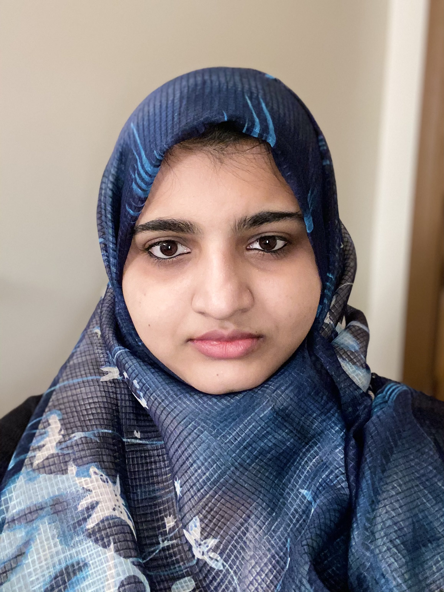

# Panorama
Spring 2021 Project Team

[Bi-Weekly Meeting Notes](docs/meetings)

Project Description:
Panorama is a cloud based photo storage and sharing application. It is a user friendly application providing multiple functionalities that include uploading, downloading, sharing and organizing your photos. The photos would be saved in an encrypted format such that they could only be accessed by the authenticated user. With bulk uploads and downloads, Panorama would ensure that you do not miss out on any photograph or information conveyed via photos. Your photos could be your life's greatest moments or cherished memories and Panorama cloud storage would ensure that they dont get lost in your phone's local storage. So pick your camera, record your daily drama, the rest will be taken care by Panorama!

Team Members:

   

Suraj Ramesh Punjabi (surajp28):
    Suraj is currently completing his Masters in Indiana University in the field of Computer Science. He has 2.5 years of experience in the I.T industry, working with ITIVITI pvt ltd as a Software Engineer. Hailed from Mumbai University, with a Bachelor's degree in Computer Engineering, he intends to strengthen his core software development skills via this course.

Vishesh Wasudeo Dembla (visheshdembla):
    Vishesh is a Software Engineer with experience in Backend Development, Compiler Design and Machine Learning. After finishing his undergraduate degree in Information Technology, he worked at SAP for 3.5 years before joining IU. With this course, he intends to gain practical distributed systems skills as well as learn about good open source practices.

Ayisha Tabbassum (ayishacs):
    Ayisha is an AWS certified Cloud and DevOps Engineer with experience in E-Commerce, Big Data and Cloud domain. After completing her bachelors degree in Electronics and Communication, she pursued her career with Cognizant Softvision, Ugam and UST global for 5 years before joining IUB for her graduate studies in Computer Science. Having worked in multi cloud environment such as AWS, GCP and Azure, she is willing to enhance her skills and gain in-depth knowledge of distributed computing concepts along with carving a niche for herself with open source community through this course

