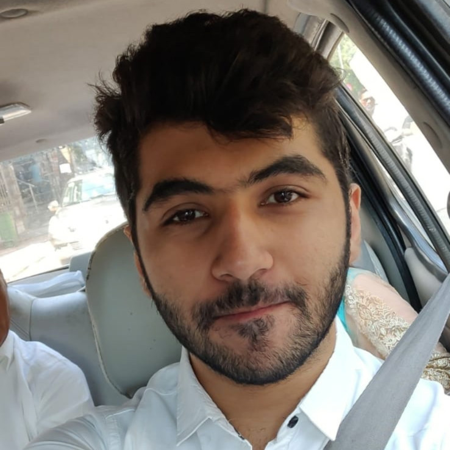
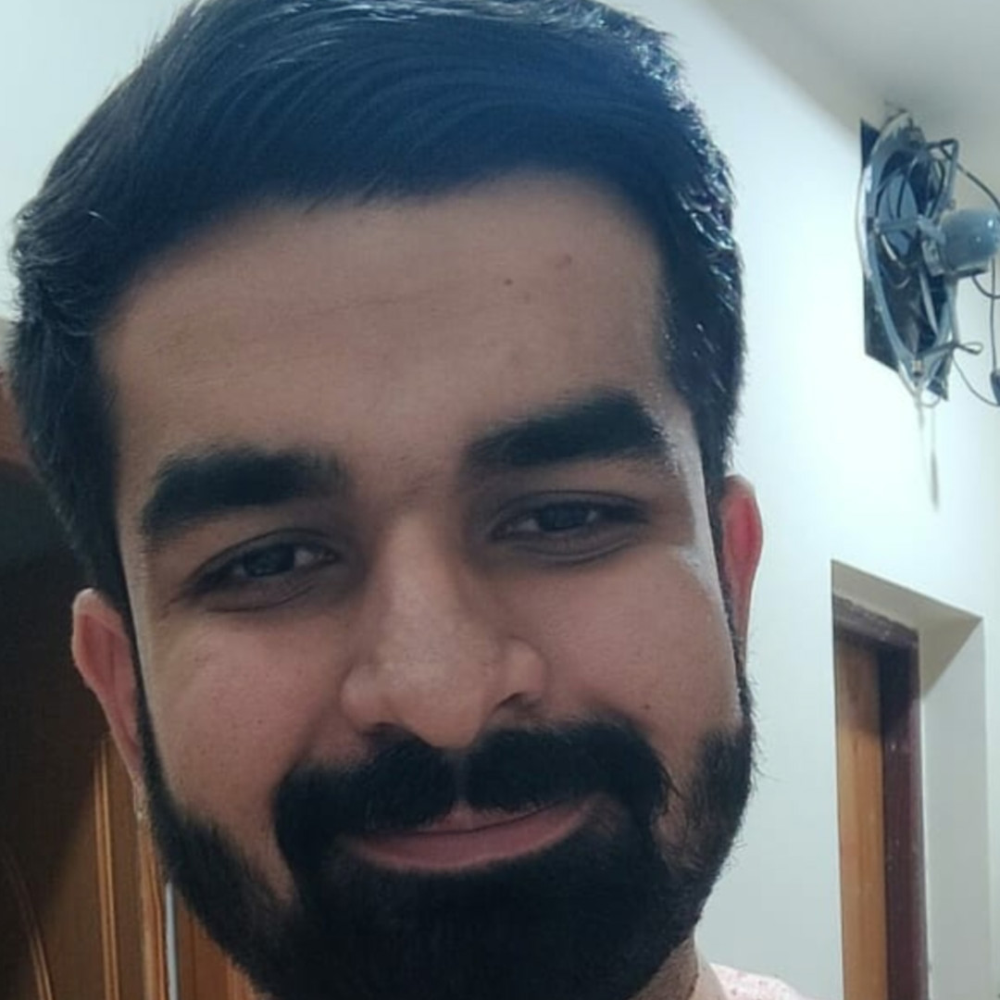

# Panorama
Spring 2021 Project Team

[Bi-Weekly Meeting Notes](docs/meetings)

Project Description:
Panorama is a photo gallery application for the web. It allows users to upload and download photos with a single click. The photos would be saved in an encrypted format such that they could only be accessed by the authenticated user. Based on one’s discretion, the photos can also be shared with other users. Panorama will be your own little world of cherished memories and to ensure these memories are always accessible, it organizes your photos and retrieves the required ones quickly. Apart from the internal organization, it also allows users to manage their photos by creating their own albums. With bulk uploads and downloads, Panorama would ensure that you do not miss out on any photograph or information conveyed via photos. 
Pick your camera, record your daily drama, the rest will be taken care by Panorama!

Team Members:

1. Suraj Ramesh Punjabi (surajp28):
    Suraj is currently completing his Masters in Indiana University in the field of Computer Science. He has 2.5 years of experience in the I.T industry, working with ITIVITI pvt ltd as a Software Engineer. His significant role includes creating 'Non-fix protocol' parser based on client requirement using java. Hailed from Mumbai University, with a Bachelor's degree in Computer Engineering, he intends to strengthen his core software development skills via this course.

2. Vishesh Wasudeo Dembla (visheshdembla):
    Vishesh is a Software Engineer with experience in Backend Development, Compiler Design and Machine Learning. After finishing his undergraduate degree in Information Technology, he worked at SAP for 3.5 years before joining IU. With this course, he intends to gain practical distributed systems skills as well as learn about good open source practices.

3. Ayisha Tabbassum (ayishacs)

